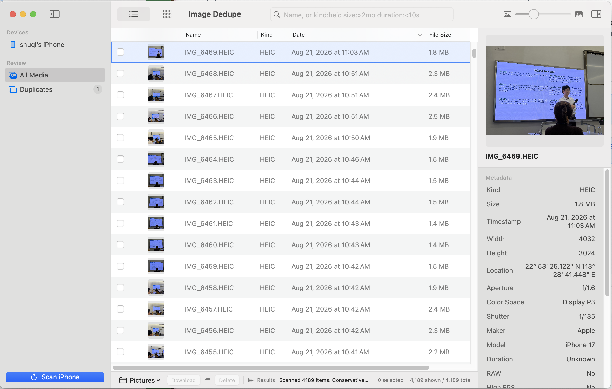

# Image Dedupe

Image Dedupe is a Mac-native tool for browsing and cleaning up media on a connected iPhone.

It scans the device into a Finder-like list or grid, lets you search and inspect the original metadata, and surfaces conservative duplicate candidates for review. Downloads and deletions remain explicit actions: the app helps you see what is there without making irreversible choices for you.

Everything stays local. There is no cloud upload, sign-in, or analytics.

> This repository is the public product page and release home. The application source code is not included.

## What It Does

- Scans photos and videos from an unlocked, trusted iPhone.
- Switches between a detailed list and a visual grid.
- Filters by name, media kind, file size, and duration.
- Shows previews and metadata, including dimensions, timestamps, camera details, and location when available.
- Groups conservative duplicate candidates for manual review.
- Downloads selected media to a chosen folder.
- Requires an explicit selection and confirmation before deletion.

## Screenshots

  
   
  Connect and unlock an iPhone, then start a local scan.

 

<table>
  <tr>
    <td align="center"><strong>Detailed List</strong></td>
    <td align="center"><strong>Visual Grid</strong></td>
  </tr>
  <tr>
    <td></td>
    <td></td>
  </tr>
</table>

  
   
  Duplicate candidates stay visible for manual review before any action.

## Safety Model

Image Dedupe never treats a similarity result as permission to delete. Duplicate candidates are a review queue, not an automatic decision. Destructive actions require selected items and a separate confirmation step.

## Requirements

- macOS 14 or later.
- An unlocked iPhone that has trusted the Mac.
- A data-capable cable connection.

If another app is holding the device session, close Photos or Image Capture and scan again.

## Availability

The public release is still being prepared. A signed and notarized installer will be published here when it is ready. The source code remains private for now.

## About

- Project home: <https://github.com/howtoexitvim/ImageDedupe>
- Project notes: <https://www.shuqihere.top/archive/projects/image-dedupe>
