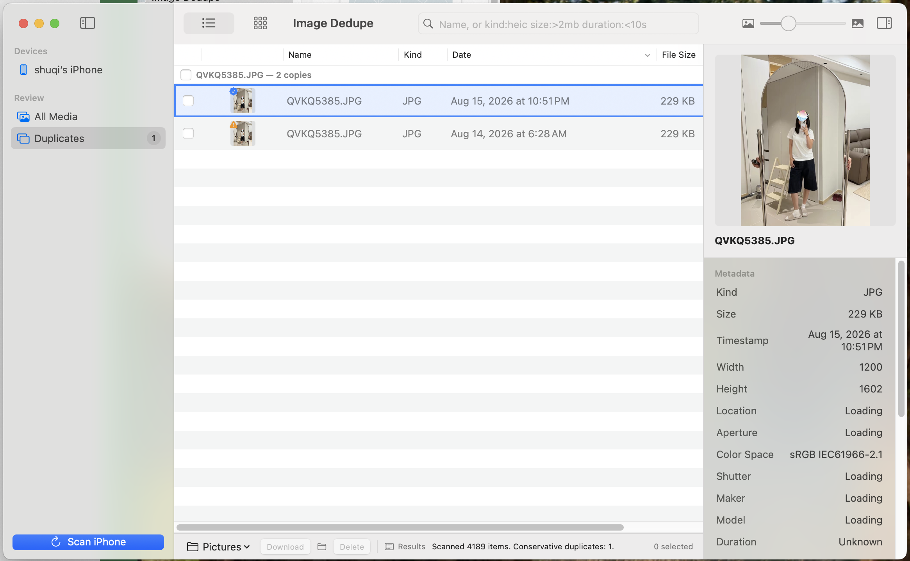
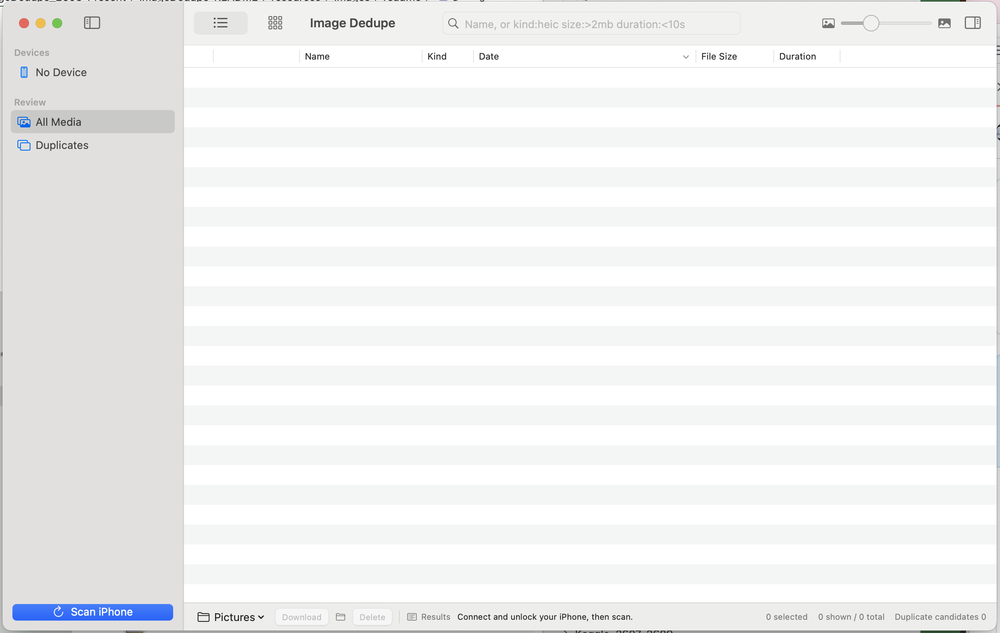
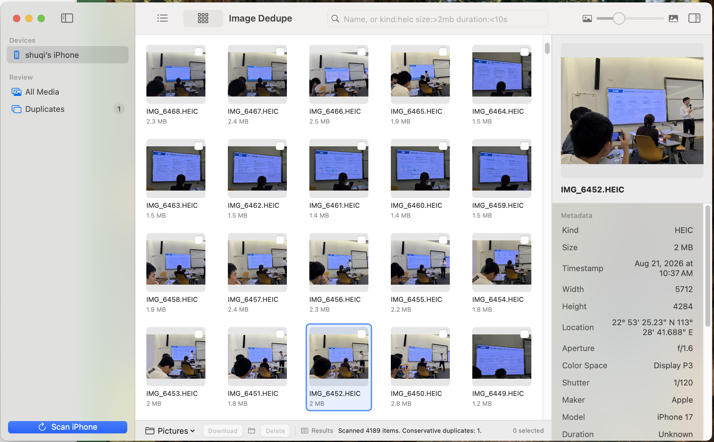

<div align="center">

# Image Dedupe

[English](README.md) · [简体中文](README.zh-CN.md) · [日本語](README.ja.md) · [한국어](README.ko.md)


</div>

Image Dedupe 是一款用来整理 iPhone 照片和视频的 Mac 应用。

插上数据线，扫描一次，所有内容就出现在同一个窗口里——可排序的列表，或是缩略图网格，旁边还有预览和元数据。搜索你想找的，下载你要留的，删掉你不再需要的。

它通过数据线、使用 Apple 自家的 ImageCaptureCore 与 iPhone 通信。没有账号，没有云端，没有数据统计，也没有任何网络请求。任何内容都不会离开你的 Mac。

也不会有任何东西被自动删除。应用只负责建议，决定权在你。

## 为什么选择 Image Dedupe

- 🔒 **全部在本地完成**：无需登录，不上传，不采集数据。只有你的 Mac 和那根线。
- 🧊 **刻意保守**：重复项只是交给你复核的候选，绝不自动删除。
- 🔍 **快速找到任何文件**：按文件名搜索，或用 `name:`、`kind:`、`size:`、`duration:` 过滤器缩小范围。
- 🖼️ **先看清，再动手**：列表或网格视图、可排序列，以及带预览和真实 EXIF 元数据的检查器。
- ⬇️ **只下载你选的**：实时进度、随时取消、目标路径预检，绝不静默覆盖。
- 🗑️ **删除必须出于本意**：应用内明确确认、留存审计记录，之后自动重新扫描。
- 🆓 **免费，采用 MIT 许可**。

## 截图

<div align="center">
  
</div>

<br/>

<table>
	<tr>
		<td align="center" colspan="2"><strong>Scanned 4189 items. Conservative duplicates: 1.</strong><br/>这行状态栏就是它的全部理念：只提出它有把握的那一个。</td>
	</tr>
	<tr>
		<td align="center"><strong>插上设备，开始扫描</strong></td>
		<td align="center"><strong>列表视图与检查器</strong></td>
	</tr>
	<tr>
		<td align="center"></td>
		<td align="center"></td>
	</tr>
	<tr>
		<td align="center"><strong>网格视图</strong></td>
		<td align="center"><strong>待复核的重复项</strong></td>
	</tr>
	<tr>
		<td align="center"></td>
		<td align="center"></td>
	</tr>
</table>

## 安装

从 [releases 页面](https://github.com/howtoexitvim/ImageDedupe/releases)下载 DMG——当前版本为 `ImageDedupe-v1.0`（版本号 1.0.0）——将 **Image Dedupe** 拖入「应用程序」文件夹。

当前构建使用 ad-hoc 签名，尚未经过公证，因此在你清除下载标记之前 macOS 会拦截它。在终端里执行一次：

```sh
xattr -dr com.apple.quarantine "/Applications/Image Dedupe.app"
```

之后即可正常打开。

**运行环境：** macOS 14 或更新版本、Apple 芯片 Mac，一台已解锁并信任此 Mac 的 iPhone，一根支持数据传输的线缆，以及在扫描期间关闭「图像捕捉」和「照片」。

## 从源码构建

需要 macOS 14 或更新版本，以及 Swift 6.2 工具链。

```sh
./scripts/build-debug-app.sh
open "$(swift build --show-bin-path)/Image Dedupe.app"
swift test
```

## 仍在路上

Developer ID 签名和 Apple 公证尚未完成——上面那一步隔离标记的清除正是因此存在。通用架构构建也在计划中。（此应用曾名为 iPhone Dedupe，你已有的操作历史与偏好设置会自动迁移。）

## License

[MIT](LICENSE)
